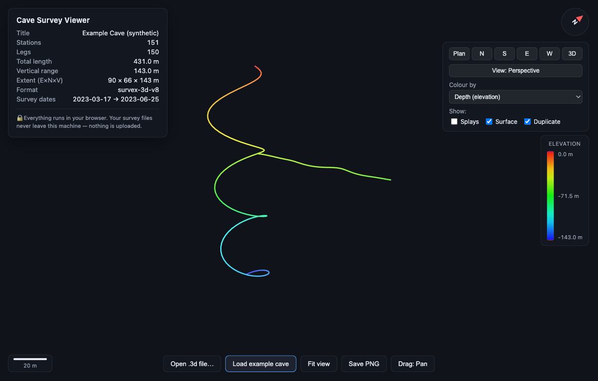

# Cave Survey Viewer

A modern, web-native 3D viewer for cave survey data. Drag a survey file onto the
page and get an interactive, depth-coloured 3D model you can orbit, pan, and zoom.

**Everything runs client-side. Your survey files never leave your machine —
nothing is uploaded.** Cave survey data is private to its surveyors, so this is a
feature, not a limitation. The app deploys as a pure static site.



## Status

| Phase | Scope | State |
|-------|-------|-------|
| **1** | Survex `.3d` (v8): centreline render, orbit/pan/zoom, depth colouring, drag-and-drop, fit-to-view, length/bounds readout, north indicator | ✅ done |
| **1+** | Preset plan/elevation views, orthographic toggle, scale bar, colour modes (elevation / distance-from-entrance / gradient / survey / single), leg-type visibility toggles, PNG export _(ideas adopted from [CaveView.js](https://github.com/aardgoose/CaveView.js))_ | ✅ done |
| 2 | Compass `.plt`; colour by date; station labels; measurement tool; survey-tree show/hide | planned |
| 3 | Therion `.lox` + wall meshes; LRUD passage tubes; clipping plane / depth cursor; depth fog | planned |

## Architecture

The project is split into two cleanly separated parts. **The parser is the
durable asset; the renderer is the demo on top.**

```
src/
  parser/          # No dependency on the renderer. Independently testable.
    types.ts       # The CaveModel contract (see below)
    byteCursor.ts  # Little-endian binary reader with bounds checking
    survex3d.ts    # Survex .3d v8 parser
    caveStats.ts   # Derived stats (total length, depth range, ...)
    index.ts       # parseCaveFile(filename, buffer) dispatcher + exports
  viewer/          # Three.js. Consumes a CaveModel; knows nothing about files.
    Viewer.ts      # Scene, camera, OrbitControls, fat-line centreline, fit-to-view
    buildCenterline.ts, colormap.ts, coords.ts, legend.ts, northIndicator.ts
  ui/              # Vanilla DOM (framework-light by design)
    hud.ts
  main.ts          # Wires parser → viewer → DOM
```

Every format parser converts its input into **one** normalized model, so the UI
can be rewritten without touching parsing, and new formats reuse the whole renderer.

### The CaveModel contract

```ts
interface CaveModel {
  metadata: {
    title: string;
    format: string;          // e.g. "survex-3d-v8"
    separator: string;       // survey hierarchy separator (default ".")
    crs?: string;            // coordinate reference system, if declared
    datestamp?: string;
    dateRange?: { from: string; to: string };   // ISO YYYY-MM-DD
    bounds: { min: Vec3; max: Vec3 };            // metres
    isExtendedElevation: boolean;
  };
  stations: { id, label, x, y, z, flags }[];     // x=East, y=North, z=Up (metres)
  legs:     { from, to, flags, survey?, date? }[]; // from/to index into stations
  walls?:   { positions: Float32Array; indices: Uint32Array };  // .lox triangle mesh
  lrud?:    { station, l, r, u, d, lastInPassage }[];           // passage cross-sections
}
```

Axes follow the surveying convention (`x`=East, `y`=North, `z`=Up), in **metres**.
The parser stays axis-faithful; all axis remapping for rendering lives in
`viewer/coords.ts`.

## Supported formats & spec references

| Format | Type | Spec / reference |
|--------|------|------------------|
| Survex `.3d` (v8) | binary | [Official 3d format spec](https://survex.com/docs/3dformat.htm); cross-checked against Survex's reference reader [`src/img.c`](https://github.com/ojwb/survex/blob/master/src/img.c) (`img_read_item_new`, `read_v8label`) |
| Compass `.plt` | text | _planned_ |
| Therion `.lox` | binary | _planned_ |

The `.3d` parser implements the v8 layout exactly — byte offsets are taken from
the spec and the reference C reader, not guessed. Files older than v8 are rejected
with a clear message (re-save with a recent `cavern`, which writes v8 by default).

## Develop, test, build

Requires Node 20+.

```bash
npm install
npm run dev          # Vite dev server with HMR
npm test             # parser test suite (vitest)
npm run typecheck    # tsc --noEmit
npm run build        # type-check then produce static site in dist/
npm run preview      # serve the production build locally
npm run gen:example  # regenerate public/example-cave.3d
```

### Testing — parser correctness is the whole ballgame

A plausible render is **not** proof the parser is correct; the numbers must match.

- **Golden test** (`test/survex3d.golden.test.ts`): parses a **real** `cavern`-written
  v8 file (`dump3ddate.3d`, vendored from Survex's own test suite) and asserts every
  leg coordinate, station label, and date against Survex's own `dump3d` reference
  output. This is the ground-truth oracle. See `test/fixtures/survex/PROVENANCE.md`.
- **Round-trip / edge cases** (`test/survex3d.encode.test.ts`): a from-spec encoder
  exercises paths the golden fixture lacks — labelled LINEs, splay/surface/duplicate
  flags, XSECT (narrow + wide), anonymous stations, CRS/separator headers, ERROR and
  DATE records, the `(del=0, add=0)` label escape, and error handling.

## Deploy — Cloudflare Pages

Pure static output, no server code or functions.

| Setting | Value |
|---------|-------|
| Build command | `npm run build` |
| Build output directory | `dist` |
| Node version | 20 |

Auto-deploys on push to `main`. The build emits a relative `base` so it works from
any path.

## Adding a new format parser

1. Create `src/parser/<format>.ts` exporting `parse<Format>(buffer: ArrayBuffer): CaveModel`.
   Depend only on `types.ts` and `byteCursor.ts` — never on the renderer.
2. For binary formats, work against the **official spec**; for byte layouts,
   cross-check a reference implementation rather than guessing.
3. Dispatch to it by extension in `parseCaveFile` (`src/parser/index.ts`).
4. Commit a **small fixture with known coordinates** and a golden test that asserts
   the numbers — ideally validated against the format's own reference tooling.
5. The renderer needs no changes: it consumes the normalized `CaveModel`.

## Controls

Two drag schemes, toggled by the **"Drag: Pan / Orbit"** toolbar button (your
choice is remembered):

- **Pan** (default, Google Earth–style): left-drag pans · right-drag orbits (rotate + tilt) · scroll zooms
- **Orbit** (3D-viewer / Aven-style): left-drag orbits · right-drag pans · scroll zooms

**View controls** (panel, top-right):

- **Preset views**: Plan (looking down, North up) and N/S/E/W elevations, plus 3D. <kbd>P</kbd> = plan.
- **Projection**: toggle Perspective ⇄ Orthographic (true-scale plan/elevation).
- **Colour by**: elevation, distance-from-entrance, gradient (steepness), survey/series, or single colour. The legend adapts to the mode.
- **Show**: toggle splay / surface / duplicate legs.

**Toolbar** (bottom):

- **Fit to view**: the "Fit view" button or press <kbd>F</kbd>
- **Save PNG**: download the current view as an image.
- **Open a file**: drag-and-drop a `.3d` anywhere, or use "Open .3d file…"

## License & attribution

`test/fixtures/survex/` contains small reference test vectors from the
[Survex](https://survex.com/) project (GPL v2+), used solely to validate
interoperability. See that directory's `PROVENANCE.md`.
